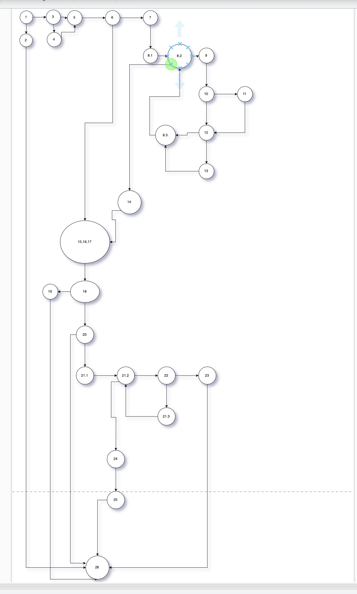
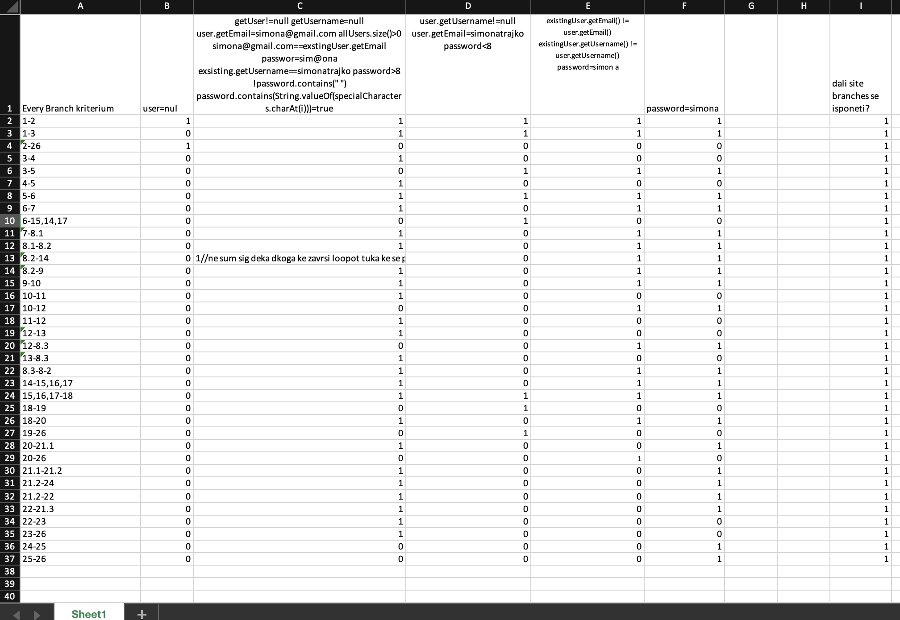

Simona Trajko 213237

**Control Flow Graph**

**Цикломатска комплексност**

Цикломатската комплекстност на овој јазол е 12, истата ја добив со формулата R каде што R е бројот на региони во Control Flow Graph-от.

**Every Branch kriterium**
 
 
 
**Multiple Condition критериумот**

				if (user==null || user.getPassword()==null || user.getEmail()==null)
	T	T	T	T
	T	T	F	T
	T	F	T	T
	T	F	F	T
	F	T	T	T
	F	T	F	T
	F	F	T	T
	F	F	F	F
				
Можни случаи за следноит пример се:				
	T	*	*	T
	
	F	T	*	T
	
	F	F	T	T
	
	F	F	F	F
  
 - за првиот случај каде што доволно е само user==null да е точно односно треба usetr==null другите два услови се не битни
 - за вториот случај каде што user!=null додека user.getPassword()==null другиот услов не ебитно дали ќе биде точен или не
 - за третиот случај првиот и вториот улов треба да се неточно односно user!=null  и user.getPassword()!=null додека user.getEmail()==null 
 - за четвртиот случај треба сите три услови да бидат неточни и само во овој случај целиот израз е не точен односно тест примерот би изгледал user!=null  и user.getPassword()!=null и user.getEmail()!=null 
 
